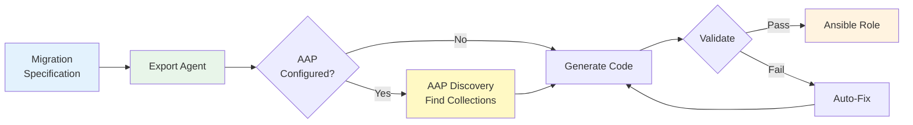
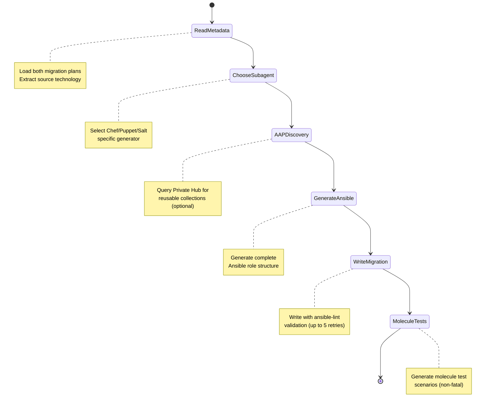
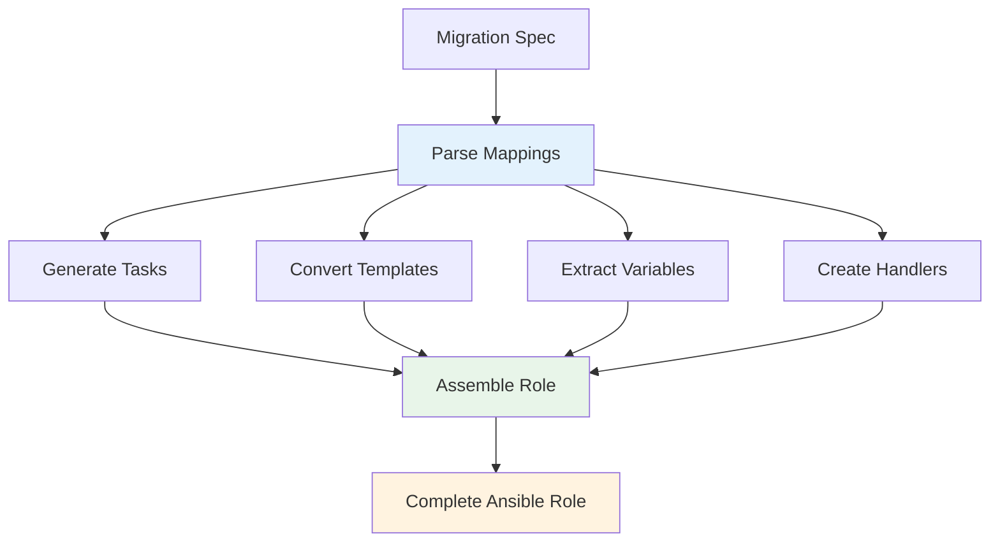
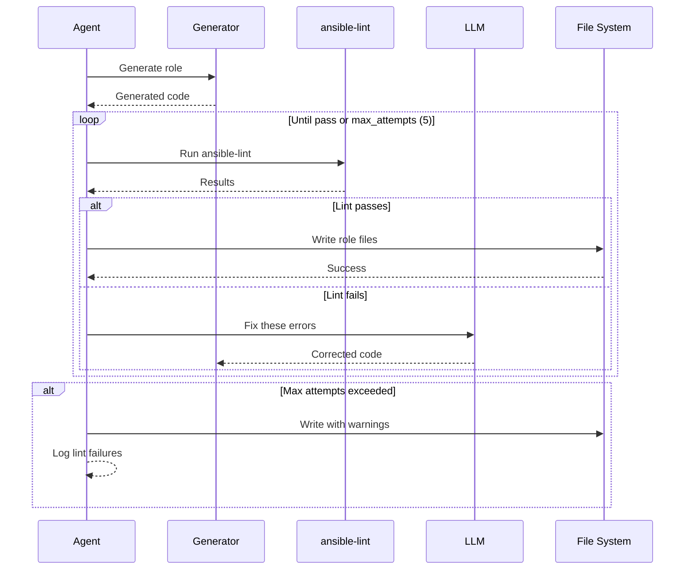
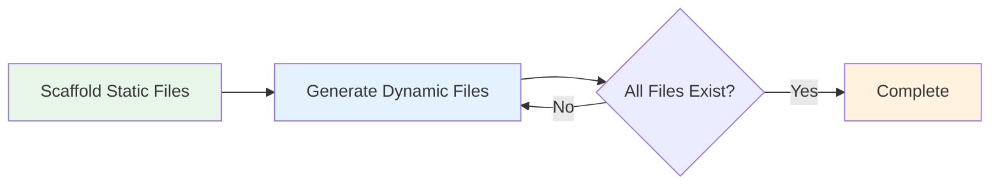
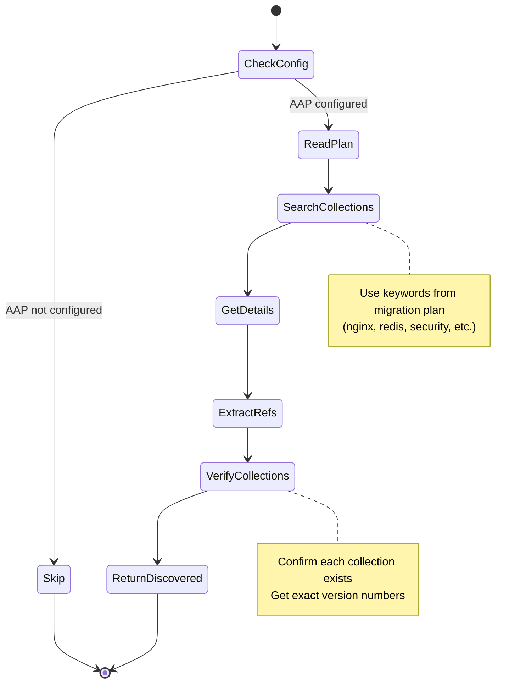
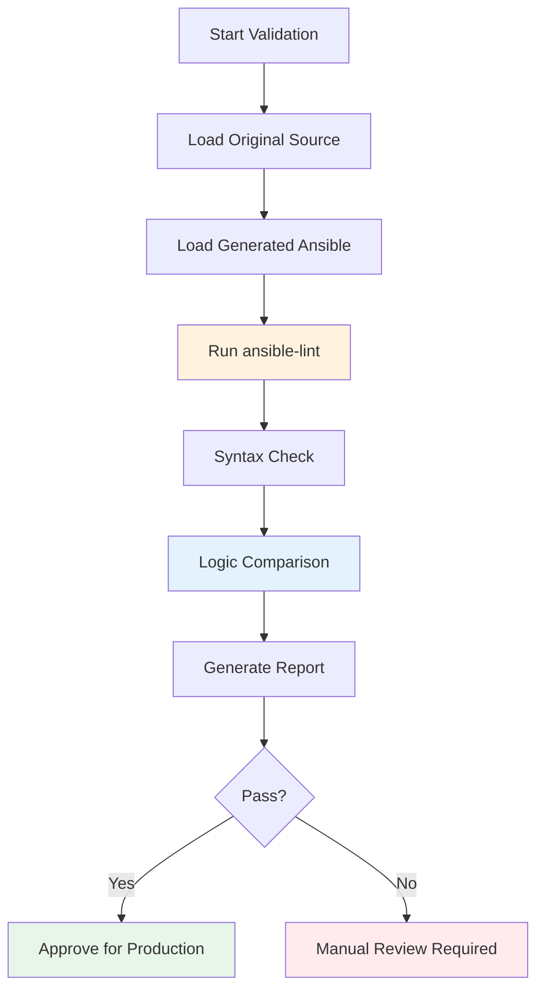

# Export Agents (Migration)

Export agents transform migration specifications into production-ready Ansible code with automated validation and quality assurance.

## Purpose

Export agents serve as the "generation" layer of X2A Convertor:

- **Generate** Ansible playbooks, roles, and templates
- **Validate** output using ansible-lint
- **Iterate** automatically to fix linting errors
- **Ensure** production readiness



## Migration Agent

**Location**: `src/exporters/migrate.py`

### Workflow



### Stage 1: Read Source Metadata

**Goal**: Load and parse migration plans

**Inputs**:

- `migration-plan.md` (high-level plan)
- `migration-plan-<module>.md` (module specification)

**Extraction**:

- Source technology (Chef/Ansible/PowerShell/Puppet/Salt)
- Source directory path
- Module name
- Dependencies

### Stage 2: Choose Subagent

**Goal**: Route to technology-specific Ansible generator

```python
def choose_migration_strategy(source_technology: str):
    if source_technology == "Chef":
        return chef_to_ansible_agent
    elif source_technology == "Ansible":
        return ansible_modernization_agent
    elif source_technology == "PowerShell":
        return powershell_to_ansible_agent
    elif source_technology == "Puppet":
        return puppet_to_ansible_agent
    elif source_technology == "Salt":
        return salt_to_ansible_agent
```

Currently implemented: Chef → Ansible, Ansible → Ansible (modernization), PowerShell → Ansible

### Stage 3: AAP Discovery (Optional)

**Goal**: Find reusable collections from Private Automation Hub

When AAP is configured (`AAP_CONTROLLER_URL` and `AAP_OAUTH_TOKEN`), the discovery agent:

1. Analyzes the migration plan to identify technologies
2. Searches the Private Hub for relevant collections
3. Verifies collection existence and retrieves exact versions
4. Passes discovered collections to the code generation stage

See [AAP Discovery Agent](#aap-discovery-agent-optional) for full details.

### Stage 4: Generate Ansible Code

**Process**:



#### Task Generation

Converts resource mappings to Ansible tasks:

**Input (from specification)**:

```markdown
| Chef Resource   | Ansible Module                                | Notes  |
| --------------- | --------------------------------------------- | ------ |
| package 'nginx' | package: name=nginx state=present             | Direct |
| service 'nginx' | service: name=nginx state=started enabled=yes | Direct |
```

**Output (Ansible task)**:

```yaml
---
- name: Install nginx package
  package:
    name: nginx
    state: present
  tags: ["packages", "nginx"]

- name: Ensure nginx service is running
  service:
    name: nginx
    state: started
    enabled: yes
  tags: ["services", "nginx"]
```

#### Template Conversion

Transforms ERB templates to Jinja2:

**Chef ERB Template**:

```erb
worker_processes <%= @worker_processes %>;

events {
    worker_connections <%= @worker_connections %>;
}

<% if @enable_ssl %>
ssl_protocols TLSv1.2 TLSv1.3;
<% end %>
```

**Ansible Jinja2 Template**:

```jinja
worker_processes {{ nginx_worker_processes }};

events {
    worker_connections {{ nginx_worker_connections }};
}


ssl_protocols TLSv1.2 TLSv1.3;

```

**Conversion Rules**:

- `<%= var %>` → `{{ var }}`
- `<% if condition %>` → ``
- `@instance_var` → `ansible_var` (following naming convention)

#### Variable Extraction

Creates Ansible defaults from Chef attributes:

**Chef Attributes**:

```ruby
default['nginx']['worker_processes'] = 'auto'
default['nginx']['worker_connections'] = 1024
default['nginx']['enable_ssl'] = true
```

**Ansible Defaults** (`defaults/main.yml`):

```yaml
---
nginx_worker_processes: auto
nginx_worker_connections: 1024
nginx_enable_ssl: true
```

#### Handler Creation

Maps Chef notifications to Ansible handlers:

**Chef Notification**:

```ruby
template '/etc/nginx/nginx.conf' do
  notifies :reload, 'service[nginx]'
end
```

**Ansible Handler** (`handlers/main.yml`):

```yaml
---
- name: Reload nginx
  service:
    name: nginx
    state: reloaded
```

### Stage 5: Write Migration Output

**Process with Validation Loop**:



**ansible-lint Integration**:

```bash
# Executed internally by agent
ansible-lint ansible/roles/<module>/

# Example output
WARNING: Listing 3 violation(s) that are fatal
risky-file-permissions: File permissions unset or incorrect
tasks/main.yml:10 Task/Handler: Configure nginx

yaml[line-length]: Line too long (142 > 120 characters)
tasks/main.yml:15

name[casing]: All names should start with an uppercase letter
handlers/main.yml:3 Task/Handler: reload nginx
```

**Auto-Fix Process**:

1. Parse lint errors
2. Send to LLM with context
3. Apply suggested fixes
4. Re-run lint
5. Repeat up to 5 times

**Example Fix**:

Before (lint error):

```yaml
- name: Configure nginx
  template:
    src: nginx.conf.j2
    dest: /etc/nginx/nginx.conf
```

After (auto-fixed):

```yaml
- name: Configure nginx
  template:
    src: nginx.conf.j2
    dest: /etc/nginx/nginx.conf
    owner: root
    group: root
    mode: "0644"
```

### Configuration

Control via environment variables:

| Variable              | Purpose                   | Default |
| --------------------- | ------------------------- | ------- |
| `MAX_EXPORT_ATTEMPTS` | ansible-lint retry limit  | 5       |
| `RECURSION_LIMIT`     | LangGraph recursion depth | 100     |
| `MAX_TOKENS`          | LLM response size         | 8192    |

### Output Structure

Complete Ansible role:

```
ansible/roles/<module-name>/
├── defaults/
│   └── main.yml          # Variables with defaults
├── files/
│   └── ...               # Static files (copied as-is)
├── handlers/
│   └── main.yml          # Event handlers
├── meta/
│   └── main.yml          # Role metadata and dependencies
├── molecule/
│   └── default/
│       ├── molecule.yml  # Molecule scenario config (delegated driver)
│       ├── create.yml    # No-op instance create
│       ├── destroy.yml   # No-op instance destroy
│       ├── converge.yml  # Recreates expected filesystem state
│       └── verify.yml    # Verification tasks from pre-flight checks
├── requirements.yml      # Collection dependencies (if AAP enabled)
├── tasks/
│   └── main.yml          # Primary task list
├── templates/
│   └── *.j2              # Jinja2 templates
└── vars/
    └── main.yml          # Higher-precedence variables (optional)
```

## Molecule Agent

**Location**: `src/exporters/molecule_agent.py`

### Purpose

The Molecule Agent generates [Molecule](https://ansible.readthedocs.io/projects/molecule/)
test scenarios for each migrated role. It runs **after** the Write Agent and **before** the
Validation Agent, so it can read the completed role structure.

### Workflow



**Phase 1 — Static scaffold** (deterministic, no LLM):
- `molecule.yml` — delegated driver configuration
- `create.yml` / `destroy.yml` — no-op playbooks

**Phase 2 — Dynamic generation** (LLM-powered):
- `converge.yml` — recreates expected filesystem state under `/tmp/molecule_test/` by reading the role's tasks
- `verify.yml` — translates pre-flight checks from the migration plan into Ansible assertion tasks

### Key Design Decisions

- **Separate from WriteAgent**: Molecule playbooks have `hosts:` keys that fail the `ValidatedWriteTool`'s ansible task validation. The Molecule Agent uses raw `WriteFileTool` instead.
- **Pre-flight checks drive verify.yml**: The migration plan's `## Pre-flight checks` section (bash commands generated during analysis) is the primary input for verification tasks.
- **Non-fatal**: Molecule generation failures are logged but do not block the migration pipeline.
- **Container-safe constraints**: No `become: true`, no `include_role`, all paths under `/tmp/molecule_test/`. Service/port checks are tagged `molecule-notest`.

## AAP Discovery Agent (Optional)

**Location**: `src/exporters/aap_discovery_agent.py`

### Purpose

When AAP (Ansible Automation Platform) integration is configured, the AAP Discovery Agent queries your Private Automation Hub to find reusable collections that can accelerate the migration.

**Benefits:**
- Reuse existing collections from your organization's Private Hub
- Reduce migration effort by leveraging pre-built roles
- Ensure consistency with organizational standards
- Automatically add collection dependencies to `requirements.yml`

### Configuration

The agent runs automatically when these environment variables are set:

| Variable | Required | Description |
|----------|----------|-------------|
| `AAP_CONTROLLER_URL` | Yes | AAP Controller base URL |
| `AAP_OAUTH_TOKEN` | Yes | OAuth token for authentication |
| `AAP_GALAXY_REPOSITORY` | No | Repository to search: `published` (default), `staging`, or `community` |

### Workflow



### Tools

The agent uses these tools to explore the Private Hub:

| Tool | Purpose |
|------|---------|
| `aap_list_collections` | List all available collections |
| `aap_search_collections` | Search by keywords (nginx, redis, etc.) |
| `aap_get_collection_detail` | Get detailed info about a collection |

### Process

1. **Analyze Migration Plan**: Extract technologies being migrated (nginx, redis, etc.)
2. **Search Private Hub**: Query for relevant collections using keywords
3. **Get Collection Details**: Retrieve roles, modules, and usage information
4. **Extract References**: Use LLM to extract structured collection data
5. **Verify Collections**: Confirm existence and get exact versions via Galaxy API
6. **Return Results**: Pass discovered collections to the write agent

### Output

Discovered collections are:

1. Added to the role's `requirements.yml`:

```yaml
# ansible/roles/<module>/requirements.yml
collections:
- name: company.redis
  version: 1.0.0
- name: company.nginx
  version: 2.3.1
```

2. Used in generated tasks via `include_role`:

```yaml
# ansible/roles/<module>/tasks/main.yml
- name: Configure Redis
  ansible.builtin.include_role:
    name: redis
    collections:
      - company.redis
  vars:
    redis_port: 6379
    redis_requirepass: secure_password
```

### Integration with Write Agent

The discovered collections are passed to the Write Agent, which:

1. Includes collection roles using `ansible.builtin.include_role`
2. Uses collection modules where applicable
3. Maps variables to match collection role interfaces
4. Generates `requirements.yml` with verified versions

### Skipping Discovery

If AAP is not configured (no `AAP_CONTROLLER_URL`), the discovery step is skipped and migration proceeds normally using only built-in Ansible modules.

## Validation Agent

**Location**: `src/exporters/validation_agent.py`

### Purpose

Post-migration validation ensures:

- ansible-lint compliance
- Logic equivalence with source
- Idempotency
- Production readiness

### Workflow



### Validation Checks

#### 1. ansible-lint Compliance

```bash
ansible-lint --force-color --parseable ansible/roles/<module>/
```

Checks for:

- Syntax errors
- Best practice violations
- Security issues
- Style consistency

#### 2. Syntax Validation

```bash
ansible-playbook --syntax-check ansible/roles/<module>/tasks/main.yml
```

Ensures:

- Valid YAML
- Valid Jinja2 in templates
- No undefined variables (with strict mode)

#### 3. Logic Equivalence

AI-powered comparison of:

- Resource execution order
- Conditional logic preservation
- Variable usage correctness
- Handler trigger conditions

**Example Comparison**:

Chef:

```ruby
package 'nginx' if node['platform_family'] == 'debian'
```

Ansible:

```yaml
- name: Install nginx
  package:
    name: nginx
    state: present
  when: ansible_os_family == 'Debian'
```

Validation: Platform family conditional correctly translated

#### 4. Idempotency Check

```bash
# First run
ansible-playbook -i test-inventory site.yml

# Second run (should show no changes)
ansible-playbook -i test-inventory site.yml
```

Expected result: `changed=0` on second run

### Validation Report

```
═══════════════════════════════════════════════
  X2A Validation Report: nginx-multisite
═══════════════════════════════════════════════

✓ ansible-lint: PASS (0 errors, 0 warnings)
✓ Syntax check: PASS
✓ Logic equivalence: PASS
✓ Idempotency: PASS

Details:
--------
Files validated: 8
Tasks generated: 24
Handlers created: 3
Templates converted: 5

Potential Concerns:
------------------
- SSL certificate path differs from Chef default
  Original: /etc/ssl/certs/nginx.crt
  Generated: /etc/nginx/ssl/nginx.crt
  Recommendation: Verify path in target environment

Production Readiness: ✓ APPROVED
```

## Ansible Best Practices

Export agents enforce:

### 1. Task Naming

All tasks have descriptive names:

```yaml
# Good
- name: Install nginx web server package
  package:
    name: nginx

# Avoided
- package:
    name: nginx
```

### 2. Idempotency

All operations are idempotent:

```yaml
# Idempotent
- name: Ensure nginx config directory exists
  file:
    path: /etc/nginx/conf.d
    state: directory
    mode: "0755"
```

### 3. Tags

Tasks tagged for selective execution:

```yaml
- name: Install nginx
  package:
    name: nginx
  tags: ["packages", "nginx", "install"]
```

### 4. Error Handling

Appropriate failure conditions:

```yaml
- name: Check nginx config validity
  command: nginx -t
  register: nginx_config_test
  failed_when: nginx_config_test.rc != 0
  changed_when: false
```

### 5. File Permissions

Explicit permissions on sensitive files:

```yaml
- name: Deploy SSL certificate
  copy:
    src: nginx.crt
    dest: /etc/nginx/ssl/nginx.crt
    owner: root
    group: root
    mode: "0600"
```
