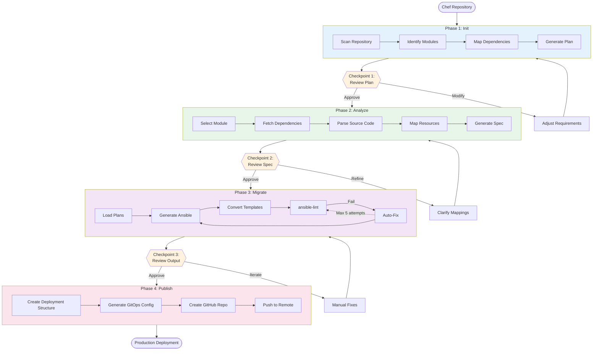
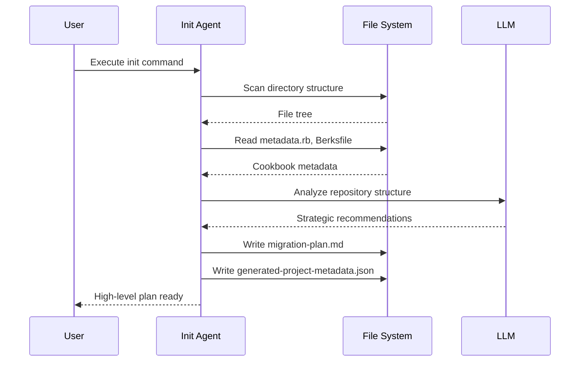
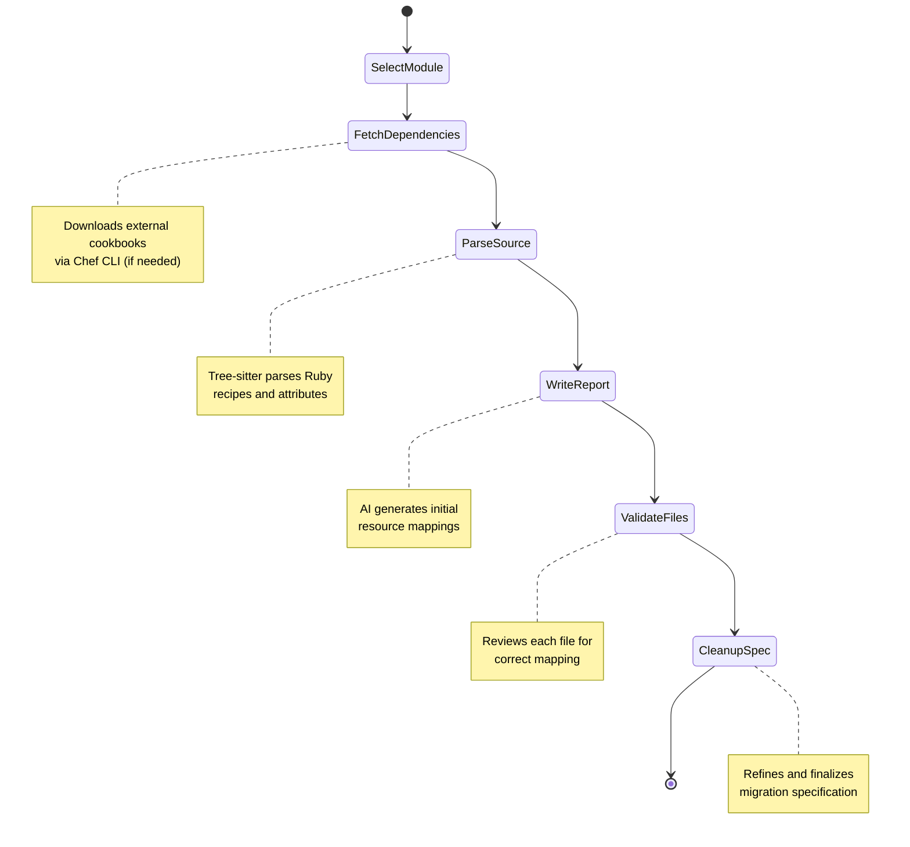
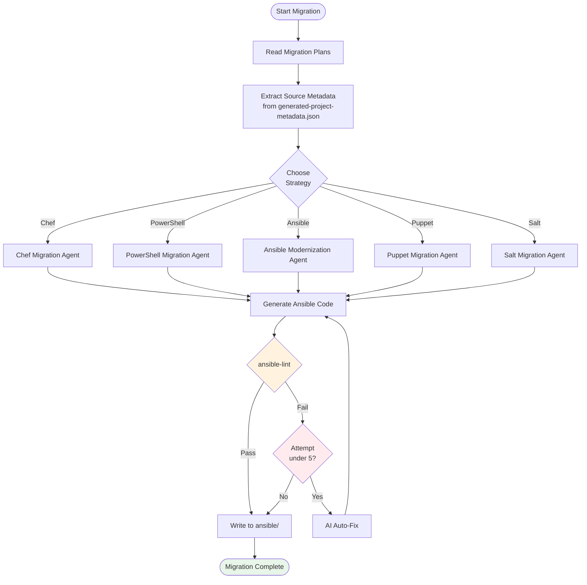
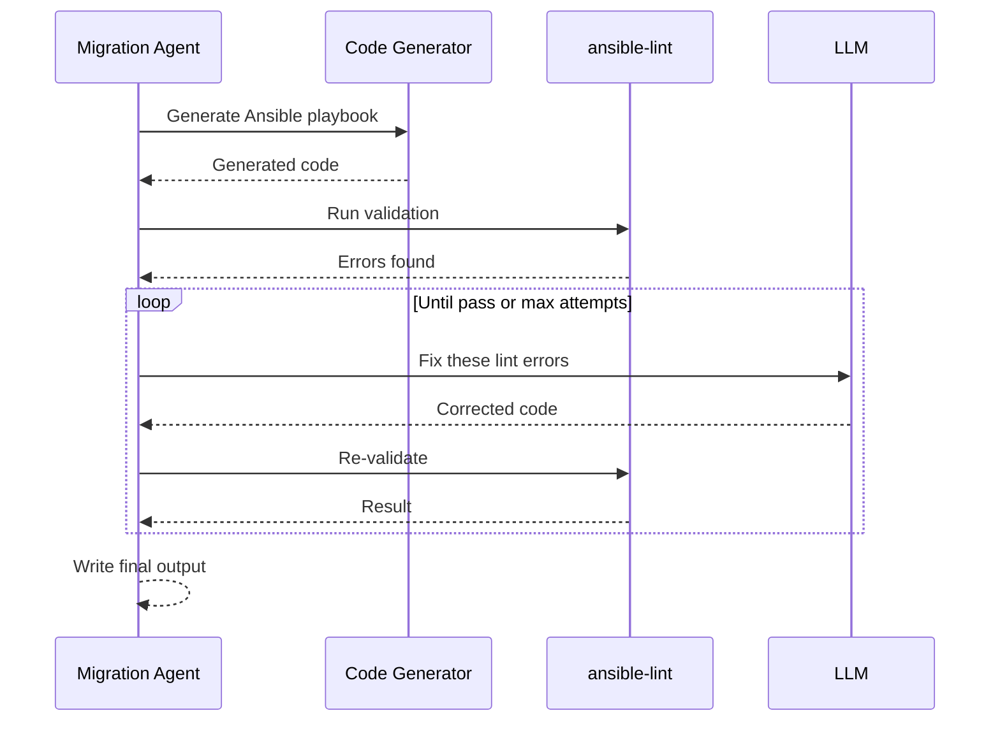
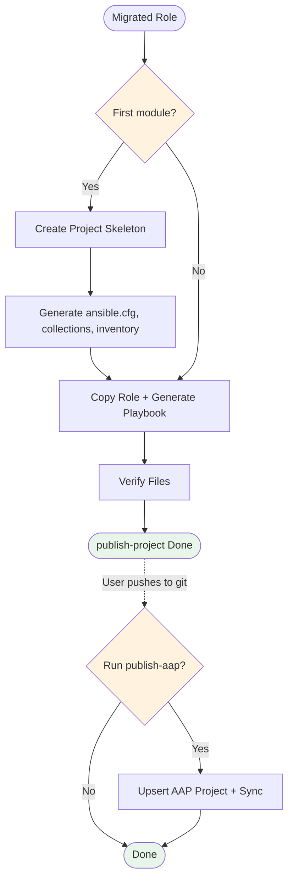

## Table of contents
{: .no_toc .text-delta }

<style>
.toc-h3-only ul li ul{
    display: none;
}
</style>
* TOC
{:toc .toc-h3-only}

# Migration Workflow

Complete end-to-end process for migrating infrastructure code from Chef/PowerShell/legacy Ansible to modern Ansible.

## Overview

X2A Convertor follows a four-phase workflow with human review checkpoints at each stage:







## Phase 1: Init

**Goal**: Create a strategic migration plan covering the entire repository.

### Command

```bash
uv run app.py init --source-dir ./chef-repo "Migrate to Ansible"
```

### Process



### Outputs

**File**: `migration-plan.md`

Contains:

- Repository structure overview
- List of all identified modules/cookbooks
- Dependency graph
- Recommended migration order
- Estimated complexity per module
- Metadata file for the UI usage.

### What to Review

- [ ] All cookbooks correctly identified
- [ ] Dependency relationships accurate
- [ ] Migration priority order makes sense
- [ ] External dependencies noted
- [ ] Complexity estimates reasonable

## Phase 2: Analyze

**Goal**: Create a detailed migration specification for a specific module.

### Command

```bash
uv run app.py analyze --source-dir ./chef-repo "Analyze nginx-multisite cookbook"
```

### Process



### Outputs

**File**: `migration-plan-<module-name>.md`

Contains:

- Module-specific overview
- File-by-file mapping
- Template list
- Variable mapping (attributes → defaults)
- Resource translation table
- Handler and notification mappings

### What to Review

- [ ] All source files mapped
- [ ] Template variable conversions correct
- [ ] Resource mappings preserve logic
- [ ] Dependencies properly handled
- [ ] Edge cases identified

## Phase 3: Migrate

**Goal**: Generate production-ready Ansible code.

### Command

```bash
uv run app.py migrate \
  --source-dir ./chef-repo \
  --source-technology Chef \
  --high-level-migration-plan migration-plan.md \
  --module-migration-plan migration-plan-nginx-multisite.md \
  "Convert nginx-multisite cookbook"
```

### Process



### Validation Loop

The migration agent automatically retries up to 5 times if ansible-lint fails:



### Outputs

**Directory**: `ansible/roles/<role-name>/`

Role names are sanitized to comply with Ansible naming standards: hyphens are replaced with underscores and the name is lowercased (e.g., `nginx-multisite` becomes `nginx_multisite`).

Structure:

```
ansible/roles/nginx_multisite/
├── defaults/
│   └── main.yml          # Converted attributes
├── files/
│   └── ...               # Static files copied
├── handlers/
│   └── main.yml          # Converted notifyactions
├── tasks/
│   └── main.yml          # Converted recipes
├── templates/
│   └── nginx.conf.j2     # Converted .erb templates
└── meta/
    └── main.yml          # Dependencies
```

### What to Review

- [ ] Task order preserves Chef recipe logic
- [ ] Templates correctly converted to Jinja2
- [ ] Variables match expected defaults
- [ ] Handlers triggered appropriately
- [ ] No ansible-lint errors
- [ ] Idempotency maintained

## Phase 4: Publish

**Goal**: Package migrated Ansible roles into a deployable project and optionally sync to AAP.

Publishing is split into two independent commands:

1. **`publish-project`** — creates a local Ansible project structure (run once per module)
2. **`publish-aap`** — syncs a git repository to AAP Controller (run after pushing to git)

### Process



### Deployment Structure

`publish-project` creates an Ansible project at `<project-id>/ansible-project/`:

```
<project-id>/ansible-project/
├── README.md
├── ansible.cfg
├── collections/requirements.yml
├── inventory/hosts.yml
├── roles/{role_name}/
├── run_{role_name}.yml
└── molecule_{role_name}.yml  (if role has molecule tests)
```

On the first module, the full skeleton is created. On subsequent modules, only the role directory and playbook are appended. The `README.md` is regenerated on every invocation so it always lists all roles in the project, along with their descriptions, default variables, target platforms, and required collections.

**Note:** Role names are sanitized to comply with Ansible naming standards — hyphens are replaced with underscores and names are lowercased. For example, a module named `fastapi-tutorial` produces `roles/fastapi_tutorial/` and `run_fastapi_tutorial.yml`.

### Key Features

- **Template-based generation**: Uses Jinja2 templates for consistent output
- **Deterministic**: No LLM calls during generation for reproducible results
- **Incremental**: Add modules one at a time; skeleton is created once
- **AAP integration**: Separate `publish-aap` command upserts an AAP Project and triggers a sync when ready
- **Summary output**: Displays files created and project location

### What to Review

- [ ] Deployment structure created correctly
- [ ] Playbook references correct role
- [ ] `collections/requirements.yml` matches the required collections
- [ ] `inventory/hosts.yml` contains the intended inventory
- [ ] AAP Project exists and syncs successfully (if using `publish-aap`)
- [ ] All credentials and execution instructions clear

## Parallel Workflows

For independent modules, run phases in parallel:

```mermaid
gantt
    title Parallel Migration (3 Modules)
    dateFormat X
    axisFormat %M min

    section Init
    Repo scan      :0, 5

    section Module A
    Analyze A      :5, 15
    Migrate A      :15, 30
    Publish A      :30, 35

    section Module B
    Analyze B      :5, 15
    Migrate B      :15, 30
    Publish B      :30, 35

    section Module C
    Analyze C      :5, 15
    Migrate C      :15, 30
    Publish C      :30, 35
```



This reduces total time from 120 minutes (sequential) to 35 minutes (parallel).

## Error Handling

### Common Failure Points

1. **Init fails to identify modules**

   - TBC

2. **Analyze cannot resolve dependencies**

   - TBC

3. **Migrate exceeds retry limit**

   - TBC

4. **Publish fails to create repository**
   - TBC

### Recovery Strategies

Each phase is idempotent and can be re-run:

```bash
# Re-run init with refined requirements
uv run app.py init --source-dir ./chef-repo "Focus on core cookbooks only"

# Re-run analyze with additional context
uv run app.py analyze --source-dir ./chef-repo "Analyze nginx with focus on SSL configuration"

# Re-run migrate after manual spec adjustments
uv run app.py migrate ... "Regenerate with updated specification"
```
