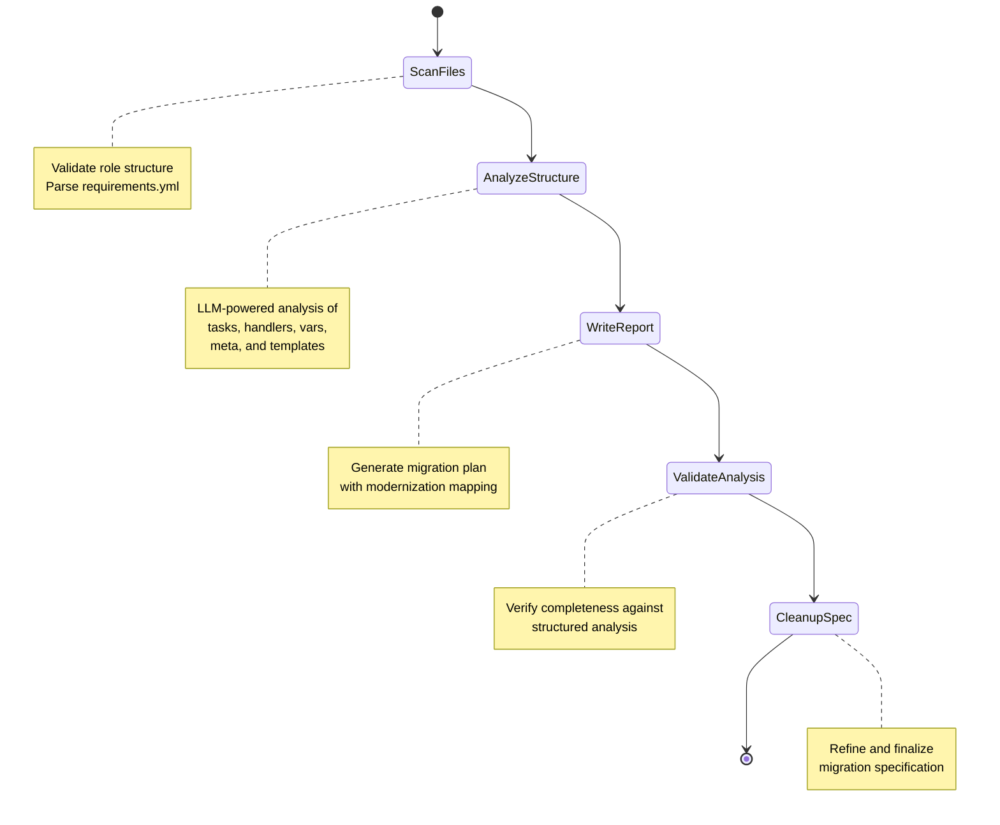

# Ansible Agent

**Location**: `src/inputs/ansible/`

The Ansible Agent modernizes legacy Ansible roles to follow current best practices. Unlike the Chef Agent which converts between languages, the Ansible Agent performs in-place modernization.

## Workflow

## Stage 1: Scan Files

**Goal**: Validate Ansible role structure and collect metadata

**Process**:
1. Check for `tasks/` directory (required)
2. Parse `requirements.yml` for existing collection dependencies
3. Validate role directory layout

## Stage 2: Analyze Structure

**Goal**: Extract execution structure from all role files using LLM

**Process**:
Four specialized analysis services run in sequence:

| Service | Files | Output |
|---------|-------|--------|
| `TaskFileAnalysisService` | `tasks/*.yml`, `handlers/*.yml` | Module names, parameters, loops, conditions, privilege escalation, legacy pattern flags |
| `VariablesAnalysisService` | `defaults/main.yml`, `vars/main.yml` | Variable names/values, legacy pattern flags (yes/no, string numbers) |
| `MetaAnalysisService` | `meta/main.yml` | Role name, dependencies, platforms, galaxy metadata |
| `TemplateAnalysisService` | `templates/*.j2` | Variables used, bare variables, deprecated Jinja2 tests |

All services use Pydantic models with `with_structured_output()` for type-safe LLM parsing.

## Stage 3: Write Report

**Goal**: Generate comprehensive migration specification

The `ReportWriterAgent` (a ReAct agent with file tools) produces a detailed modernization plan covering 21 categories:

- FQCN migration, deprecated includes, loop modernization
- Privilege escalation, fact access, boolean truthiness
- Octal quoting, argument specs, module defaults
- Template modernization, error handling patterns

## Stage 4: Validate Analysis

**Goal**: Cross-check specification against structured analysis

The `AnalysisValidationAgent` verifies:
- All analyzed files are mentioned in the plan
- All handlers are preserved (including both restart and reload)
- All vars/main.yml variables are preserved
- `requirements.yml` does not include `ansible.builtin`
- Module counts and names match the structured analysis

## Stage 5: Cleanup Specification

**Goal**: Consolidate and finalize the migration plan

**Output**: `migration-plan-<role-name>.md`

## Modernization Categories

The Ansible Agent checks for and documents modernization needs across these categories:

| # | Category | Example |
|---|----------|---------|
| 1 | FQCN | `copy` → `ansible.builtin.copy` |
| 2 | Deprecated includes | `include:` → `include_tasks:` |
| 3 | Loop modernization | `with_items:` → `loop:` |
| 4 | Privilege escalation | `sudo: yes` → `become: true` |
| 5 | Jinja2 bare variables | Wrap in `{{ }}` |
| 6 | Fact access | `ansible_hostname` → `ansible_facts['hostname']` |
| 7 | Strict mode octals | `mode: 0644` → `mode: "0644"` |
| 8 | Argument specs | Generate `meta/argument_specs.yml` |
| 9 | Truthiness | `yes`/`no` → `true`/`false` |
| 10 | Error handling | `ignore_errors` → `block`/`rescue`/`always` |
| 11 | Idempotency | Add `changed_when` to command/shell tasks |
| 12 | Module defaults | Consolidate repeated `become: true` |
| 13 | Handler name casing | `restart nginx` → `Restart nginx` (ansible-lint compliance) |
| 14 | Template modernization | `.iteritems()` → `.items()`, TLS version upgrades |
