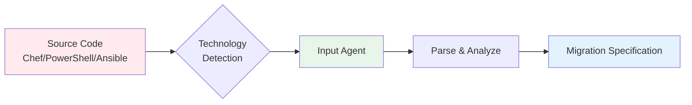

# Input Agents (Analysis)

Input agents analyze source infrastructure code (Chef, PowerShell, or legacy Ansible) to understand configuration intent and create detailed migration specifications.

## Purpose

Input agents serve as the "understanding" layer of X2A Convertor:

- **Parse** source code using language-specific tools
- **Extract** configuration logic, dependencies, and patterns
- **Document** migration requirements in structured format
- **Validate** completeness and accuracy of analysis



## Agent Architecture

### Technology Router

Located in `src/inputs/analyze.py`, routes to appropriate agent:

```python
def analyze_project(user_requirements: str, source_dir: str):
    technology = detect_technology(source_dir)

    if technology == "chef":
        return chef_agent.analyze(user_requirements, source_dir)
    elif technology == "puppet":
        return puppet_agent.analyze(user_requirements, source_dir)
    elif technology == "salt":
        return salt_agent.analyze(user_requirements, source_dir)
```

Detection based on:
- Chef: `metadata.rb`, `Berksfile`, `.rb` recipes
- PowerShell: `.ps1`, `.psm1`, `.psd1` scripts
- Ansible: `tasks/`, `handlers/`, `defaults/` role structure
- Puppet: `metadata.json`, `.pp` manifests (framework ready)
- Salt: `top.sls`, `.sls` state files (framework ready)

## Available Agents

### [Chef Agent]()
Analyzes Chef cookbooks, recipes, templates, and attributes. Resolves dependencies from Chef Supermarket and generates migration specifications for converting Chef resources to Ansible modules.

### [PowerShell Agent]()
Analyzes PowerShell scripts, modules, and DSC (Desired State Configuration) configurations. Generates migration specifications for converting Windows automation to Ansible.

### [Ansible Agent]()
Modernizes legacy Ansible roles to follow current best practices. Performs in-place modernization with FQCN migration, loop updates, and module defaults.

## Common Workflow Pattern

All input agents follow a similar workflow pattern:

1. **Scan Files**: Discover and classify source files
2. **Analyze Structure**: Extract configuration logic using LLM-powered analysis
3. **Write Report**: Generate comprehensive migration specification
4. **Validate Analysis**: Cross-check specification against structured analysis
5. **Cleanup Specification**: Refine and finalize the migration plan

Each agent implements this workflow using a LangGraph-based state machine for reliable, observable execution.
