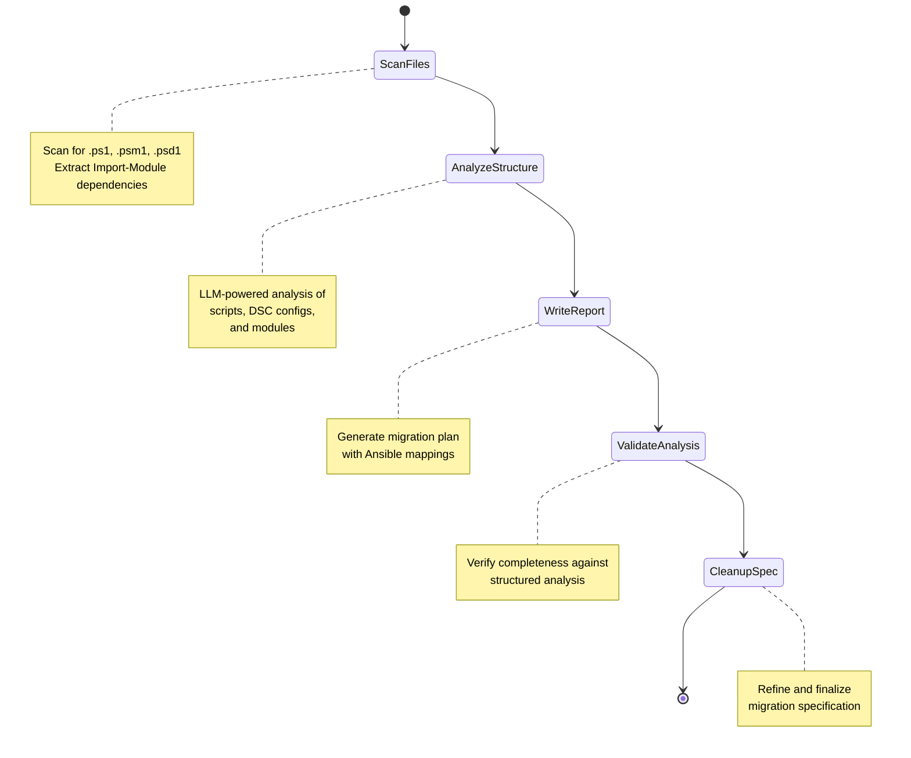

# PowerShell Agent

**Location**: `src/inputs/powershell/`

The PowerShell Agent analyzes PowerShell scripts, modules, and DSC (Desired State Configuration) configurations to create migration specifications for converting Windows automation to Ansible.

## Workflow

## Stage 1: Scan Files

**Goal**: Discover and classify PowerShell files by type

**Process**:
1. Recursively scan for `.ps1`, `.psm1`, and `.psd1` files
2. Extract `Import-Module` dependencies from all files
3. Classify `.ps1` files as scripts or DSC configurations

**File Types**:
- **Scripts (`.ps1`)**: General PowerShell automation scripts
- **DSC Configurations (`.ps1`)**: Files containing `Configuration`, `Import-DscResource`, or `Node` blocks
- **Modules (`.psm1`)**: Reusable PowerShell module files
- **Module Manifests (`.psd1`)**: Module metadata files

## Stage 2: Analyze Structure

**Goal**: Extract execution structure from all PowerShell files using LLM

**Process**:
Three specialized analysis services run in sequence:

| Service | Files | Output |
|---------|-------|--------|
| `ScriptAnalysisService` | Regular `.ps1` scripts | Command sequence, cmdlet calls, parameters, control flow |
| `DSCAnalysisService` | DSC `.ps1` configurations | Configuration name, node targets, DSC resources, properties |
| `ModuleAnalysisService` | `.psm1` modules | Exported functions, dependencies, parameters |

All services use Pydantic models with `with_structured_output()` for type-safe LLM parsing.

## Stage 3: Write Report

**Goal**: Generate comprehensive migration specification

The `ReportWriterAgent` (a ReAct agent with file tools) produces a detailed migration plan covering:

- PowerShell cmdlet to Ansible module mappings
- DSC resource to Ansible module conversions
- Variable and parameter transformations
- Error handling and logging patterns
- Module dependencies and requirements

**Example Mappings**:

| PowerShell | Ansible Equivalent | Notes |
|------------|-------------------|-------|
| `Install-WindowsFeature` | `ansible.windows.win_feature` | Direct mapping |
| `Copy-Item` | `ansible.windows.win_copy` | Path parameter mapping |
| `Service` | `ansible.windows.win_service` | State and startup type mapping |
| `Registry` (DSC) | `ansible.windows.win_regedit` | Registry key/value conversion |
| `File` (DSC) | `ansible.windows.win_file` | Ensure present/absent mapping |

## Stage 4: Validate Analysis

**Goal**: Cross-check specification against structured analysis

The `AnalysisValidationAgent` verifies:
- All analyzed files are mentioned in the plan
- All DSC resources have Ansible equivalents
- All module dependencies are documented
- Command counts and names match the structured analysis

## Stage 5: Cleanup Specification

**Goal**: Consolidate and finalize the migration plan

**Output**: `migration-plan-<project-name>.md`

## Supported PowerShell Features

The PowerShell Agent analyzes and documents migration paths for:

| Category | PowerShell Feature | Ansible Target |
|----------|-------------------|----------------|
| Commands | Cmdlets (Get-*, Set-*, New-*, etc.) | `ansible.windows.*` modules |
| DSC | Configuration blocks | Playbook tasks |
| DSC | DSC Resources | Windows modules |
| Modules | Function exports | Ansible role tasks |
| Parameters | Script parameters | Role variables |
| Control Flow | If/else, loops | Ansible conditionals, loops |
| Error Handling | Try/catch, ErrorAction | `block`/`rescue`/`always` |
