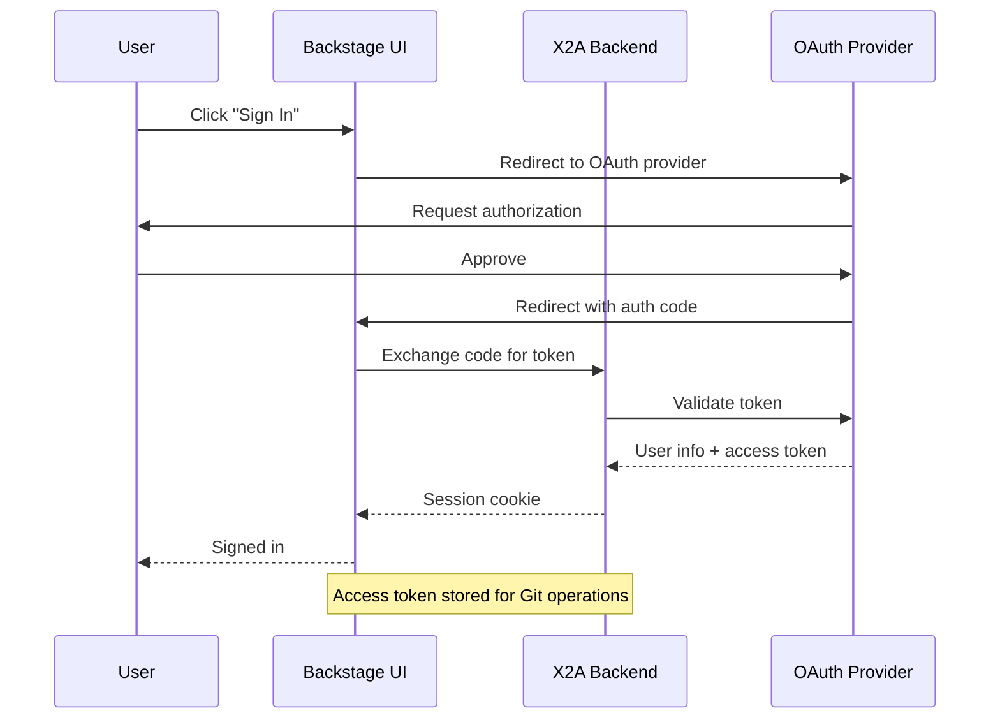

# Authentication

The X2Ansible UI uses OAuth-based authentication through Backstage's authentication framework. Users sign in via their Git provider accounts (GitHub, GitLab, or Bitbucket).

## Overview

Authentication serves two purposes in X2Ansible:

1. **User Identity**: Identifies who is accessing the system
2. **Source Control Access**: Provides OAuth tokens for reading/writing Git repositories

## Supported Providers

### GitHub

**Configuration** in `app-config.yaml`:

```yaml
auth:
  providers:
    github:
      development:
        clientId: ${AUTH_GITHUB_CLIENT_ID}
        clientSecret: ${AUTH_GITHUB_CLIENT_SECRET}
        signIn:
          resolvers:
            - resolver: usernameMatchingUserEntityName
```

**Setup**:
1. Create a GitHub OAuth application at [github.com/settings/developers](https://github.com/settings/developers)
2. Set the callback URL to `http://localhost:7007/api/auth/github/handler/frame` (development) or your production URL
3. Copy the Client ID and Client Secret to environment variables

**Required Scopes**: Automatically configured by Backstage (includes `repo`, `user`)

### GitLab

**Configuration** in `app-config.yaml`:

```yaml
auth:
  providers:
    gitlab:
      development:
        clientId: ${AUTH_GITLAB_CLIENT_ID}
        clientSecret: ${AUTH_GITLAB_CLIENT_SECRET}
        audience: https://gitlab.com
        signIn:
          resolvers:
            - resolver: usernameMatchingUserEntityName
```

**Setup**:
1. Create a GitLab OAuth application at [gitlab.com/-/user_settings/applications](https://gitlab.com/-/user_settings/applications)
2. Set the redirect URI to `http://localhost:7007/api/auth/gitlab/handler/frame`
3. Request scopes: `read_user`, `read_repository`, `write_repository`, `openid`, `profile`, `email`
4. Copy the Application ID and Secret to environment variables

**Required Scopes** (per [Backstage documentation](https://backstage.io/docs/auth/gitlab/provider/)):
- `read_user`
- `read_repository`
- `write_repository`
- `openid`, `profile`, `email`

### Bitbucket

**Configuration** in `app-config.yaml`:

```yaml
auth:
  providers:
    bitbucket:
      development:
        clientId: ${AUTH_BITBUCKET_CLIENT_ID}
        clientSecret: ${AUTH_BITBUCKET_CLIENT_SECRET}
        signIn:
          resolvers:
            - resolver: usernameMatchingUserEntityAnnotation
```

**Setup**:
1. Create a Bitbucket OAuth consumer at `https://bitbucket.org/[YOUR_WORKSPACE]/workspace/settings/api`
2. Set the callback URL to `http://localhost:7007/api/auth/bitbucket`
3. Request the following scopes:
   - `account:read`
   - `workspace membership:read`
   - `project:read`
   - `snippet:write`
   - `issue:write`
   - `pullrequest:write`
4. Copy the Key (Client ID) and Secret to environment variables

**Note**: Bitbucket uses `usernameMatchingUserEntityAnnotation` resolver instead of `usernameMatchingUserEntityName`.

## Sign-In Resolvers

Sign-in resolvers map OAuth user identities to Backstage user entities:

| Resolver | Provider | Behavior |
|----------|----------|----------|
| `usernameMatchingUserEntityName` | GitHub, GitLab | Matches OAuth username to Backstage user entity name |
| `usernameMatchingUserEntityAnnotation` | Bitbucket | Matches OAuth username to Backstage user annotation |

## Guest User (Development Only)

For local development without OAuth setup, enable the guest provider:

```yaml
auth:
  environment: development
  providers:
    guest: {}
```

The guest user (`user:development/guest`) has limited permissions and is **not recommended for production**.

## User Management

Red Hat Developer Hub provides multiple ways to manage users in the catalog:

### Option 1: Automatic User Import from Git Providers (Recommended)

The recommended approach is to use **catalog provider plugins** to automatically import users and groups from your Git provider organization. This provides one-way synchronization where user and group data flow from your identity provider to the Developer Hub software catalog.

#### GitHub Organization Import

Enable the GitHub catalog provider to automatically import users and groups:

**Configuration in `app-config.yaml`:**

```yaml
catalog:
  providers:
    github:
      providerId:
        organization: 'your-github-org'
        catalogPath: '/catalog-info.yaml'
        filters:
          branch: 'main'
        schedule:
          frequency:
            minutes: 30
          timeout:
            minutes: 3
```

**Required Configuration:**
1. GitHub OAuth app configured in `auth.providers.github`
2. GitHub integration configured in `integrations.github`
3. GitHub catalog provider plugin enabled in `dynamic-plugins.yaml`

**What gets imported:**
- All users from your GitHub organization
- All teams as groups
- User-to-group relationships (team memberships)

See: [Integrating Red Hat Developer Hub with GitHub](https://docs.redhat.com/en/documentation/red_hat_developer_hub/1.7/html-single/integrating_red_hat_developer_hub_with_github/index)

#### GitLab Group Import

Enable the GitLab catalog provider to import users from GitLab groups:

**Configuration in `app-config.yaml`:**

```yaml
catalog:
  providers:
    gitlab:
      yourProviderId:
        host: gitlab.com
        group: 'your-gitlab-group'
        schedule:
          frequency:
            minutes: 30
          timeout:
            minutes: 3
```

**Required Configuration:**
1. GitLab OAuth app configured in `auth.providers.gitlab`
2. GitLab integration configured in `integrations.gitlab`
3. Access token with `read_api` scope for the GitLab integration

See: [Guide to configuring multiple authentication providers in Developer Hub](https://developers.redhat.com/articles/2026/02/11/guide-configuring-multiple-authentication-providers-developer-hub)

#### Bitbucket Workspace Import

Bitbucket catalog provider support varies by version. Consult the [RHDH documentation](https://docs.redhat.com/en/documentation/red_hat_developer_hub/1.8/html-single/authentication_in_red_hat_developer_hub/index) for your version.

### Option 2: Manual User Definition (Development Only)

For local development and testing, you can manually define users in a YAML file:

**Configuration in `app-config.yaml`:**

```yaml
catalog:
  locations:
    - type: file
      target: ../../examples/org.yaml
      rules:
        - allow: [User, Group]
```

**Example `examples/org.yaml`:**

```yaml
apiVersion: backstage.io/v1alpha1
kind: User
metadata:
  name: jdoe
spec:
  profile:
    displayName: Jane Doe
    email: jane.doe@example.com
  memberOf:
    - developers
---
apiVersion: backstage.io/v1alpha1
kind: Group
metadata:
  name: developers
spec:
  type: team
  children: []
```

**Important:** Manual user definitions are **not recommended for production**. Use catalog providers to automatically sync users from your identity provider.

### Option 3: Multiple Identity Providers (Advanced)

Starting with RHDH 1.9.0, you can integrate multiple identity providers and catalog providers. This allows users from different sources (GitHub, GitLab, Keycloak, etc.) to coexist.

**Security Consideration:** When using multiple catalog providers, manage entities with conflicting entityRefs carefully. Always ensure the primary provider is the most trusted and authoritative source.

See: [Backstage authentication and catalog providers: A practical guide](https://developers.redhat.com/articles/2025/01/07/backstage-authentication-and-catalog-providers-practical-guide)

## Adding Users

To grant a user access to X2Ansible:

1. **Ensure the user has an account** with the configured OAuth provider (GitHub, GitLab, or Bitbucket)
2. **Import users to the catalog**:
   - **Production**: Configure catalog provider plugin to auto-import from your Git organization
   - **Development**: Add user entity to `examples/org.yaml` (not recommended for production)
3. **Assign permissions** via RBAC policies (see [Authorization]())

## Environment Variables

Set the following environment variables before starting the UI:

```bash
# GitHub OAuth
export AUTH_GITHUB_CLIENT_ID=your_github_client_id
export AUTH_GITHUB_CLIENT_SECRET=your_github_client_secret

# GitLab OAuth
export AUTH_GITLAB_CLIENT_ID=your_gitlab_client_id
export AUTH_GITLAB_CLIENT_SECRET=your_gitlab_client_secret

# Bitbucket OAuth
export AUTH_BITBUCKET_CLIENT_ID=your_bitbucket_key
export AUTH_BITBUCKET_CLIENT_SECRET=your_bitbucket_secret
```

## Authentication Flow



## Troubleshooting

### "User not found" after sign-in

**Cause**: User entity does not exist in the catalog.

**Solution**:
- **Production**: Ensure the catalog provider is configured and running. Check that the user is a member of the configured organization/group.
- **Development**: Add the user entity to `examples/org.yaml` and restart the backend.

### "Missing session cookie" on refresh

**Cause**: Popup and main window have different cookie contexts.

**Solution**: Set `enableExperimentalRedirectFlow: true` in `app-config.yaml` to use redirect flow instead of popup.

### OAuth callback errors

**Cause**: Callback URL mismatch between OAuth app configuration and actual deployment URL.

**Solution**: Verify the callback URL matches exactly (including protocol and port). Development callback URLs typically use `http://localhost:7007`, while production uses your public domain with HTTPS.

## Security Considerations

- **OAuth tokens** are stored securely and used for Git operations (clone, push)
- **Credentials** are passed to Kubernetes jobs as secrets and deleted after job completion
- **Session cookies** expire based on Backstage's default session management
- **Production deployments** should use HTTPS and secure session secrets
