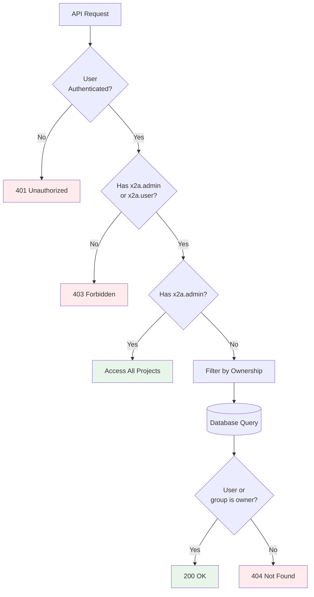

# Authorization

X2Ansible uses Role-Based Access Control (RBAC) to manage permissions for projects and resources. The authorization system controls who can view, create, and modify migration projects.

## Permission Model

X2Ansible defines three permission types:

| Permission | Action | Scope | Description |
|------------|--------|-------|-------------|
| `x2a.admin` | `read` | All projects | View all projects (read-only) |
| `x2a.admin` | `update` | All projects | Full access to all projects (read-write) |
| `x2a.user` | `use` | Owned projects | Manage projects owned by user or their groups |


## Ownership Model

Projects are owned by either:

1. **User**: The user who created the project
2. **Group**: A group the user belongs to (specified at project creation)

Users with `x2a.user` permission can only access projects where:
- They are the owner, OR
- One of their groups is the owner

Users with `x2a.admin` permission (read or update) can access all projects regardless of ownership.

## RBAC Policy Configuration

RBAC policies are defined in a CSV file and referenced in `app-config.yaml`:

```yaml
permission:
  enabled: true
  rbac:
    policies-csv-file: ../../examples/example-rbac-policy.csv
    policyFileReload: true
    pluginsWithPermission:
      - x2a
```

### Policy File Format

The RBAC policy file (`examples/example-rbac-policy.csv`) uses Casbin CSV format:

```csv
# Format: p, role, permission, action, effect
p, role:default/x2aAdmin, x2a.admin, read, allow
p, role:default/x2aAdmin, x2a.admin, update, allow
p, role:default/x2aUser, x2a.user, use, allow

# Format: g, user/group, role
g, user:default/alice, role:default/x2aAdmin
g, group:default/developers, role:default/x2aUser
```

**Policy Types**:
- `p` (policy): Assigns permissions to roles
- `g` (grouping): Assigns users/groups to roles

## Role Examples

### Admin with Full Access

```csv
p, role:default/x2aAdmin, x2a.admin, read, allow
p, role:default/x2aAdmin, x2a.admin, update, allow

g, user:default/alice, role:default/x2aAdmin
g, group:default/x2a-admin-group, role:default/x2aAdmin
```

**Capabilities**:
- View all projects
- Create, update, delete any project
- Run jobs on any project

### Admin with Read-Only Access

```csv
p, role:default/x2aViewerAdmin, x2a.admin, read, allow

g, user:default/bob, role:default/x2aViewerAdmin
```

**Capabilities**:
- View all projects
- **Cannot** create, update, or delete projects
- **Cannot** run jobs (unless also granted `x2a.user`)

To allow read-only admin to run their own projects:

```csv
p, role:default/x2aViewerAdmin, x2a.admin, read, allow
p, role:default/x2aViewerAdmin, x2a.user, use, allow

g, user:default/bob, role:default/x2aViewerAdmin
```

### Regular User

```csv
p, role:default/x2aUser, x2a.user, use, allow

g, user:default/charlie, role:default/x2aUser
g, group:default/developers, role:default/x2aUser
```

**Capabilities**:
- View projects they own or their groups own
- Create new projects
- Update and delete their own projects
- Run jobs on their projects

### Guest User (Development Only)

```csv
g, user:development/guest, role:default/x2aUser
```

Guest user has `x2a.user` permission for testing without OAuth setup.

## Group Membership

Users can belong to groups defined in the Backstage catalog:

```yaml
# examples/org.yaml
---
apiVersion: backstage.io/v1alpha1
kind: Group
metadata:
  name: developers
spec:
  type: team
  children: []
---
apiVersion: backstage.io/v1alpha1
kind: User
metadata:
  name: charlie
spec:
  memberOf:
    - developers
```

When a user creates a project, they can assign it to one of their groups. All group members with `x2a.user` permission can then access that project.

## Example RBAC Policy

Here's a complete example from `examples/example-rbac-policy.csv`:

```csv
# Define roles and their permissions
p, role:default/x2aAdmin, x2a.admin, read, allow
p, role:default/x2aAdmin, x2a.admin, update, allow

p, role:default/x2aViewerAdmin, x2a.admin, read, allow

p, role:default/x2aUser, x2a.user, use, allow

# Assign users to roles
g, user:development/guest, role:default/x2aUser
g, user:default/elai-shalev, role:default/x2aAdmin
g, group:default/x2a-admin-group, role:default/x2aAdmin
```

## Permission Decision Flow



## Configuring RBAC

### Step 1: Enable Permissions

In `app-config.yaml`:

```yaml
permission:
  enabled: true
  rbac:
    policies-csv-file: ../../examples/example-rbac-policy.csv
    policyFileReload: true
    pluginsWithPermission:
      - x2a
```

### Step 2: Define Roles

Create or edit the RBAC policy file:

```csv
# Admin role with full access
p, role:default/x2aAdmin, x2a.admin, read, allow
p, role:default/x2aAdmin, x2a.admin, update, allow

# User role with ownership-based access
p, role:default/x2aUser, x2a.user, use, allow
```

### Step 3: Assign Users

Add user/group assignments to the policy file:

```csv
# Individual user assignment
g, user:default/alice, role:default/x2aAdmin

# Group assignment (all members get the role)
g, group:default/x2a-admins, role:default/x2aAdmin
g, group:default/developers, role:default/x2aUser
```

## Troubleshooting

### User Cannot See Any Projects

**Cause**: User lacks both `x2a.admin` and `x2a.user` permissions.

**Solution**: Add user to a role with at least `x2a.user` permission.

### User Cannot See Specific Project

**Cause**: Project is owned by a different user or group.

**Solution**:
- Grant user `x2a.admin` (read) permission to view all projects, OR
- Add user to the group that owns the project

### User Can View But Cannot Edit

**Cause**: User has `x2a.admin` with `read` action but not `update`.

**Solution**: Add `x2a.admin` with `update` action, or grant `x2a.user` if they own the project.

