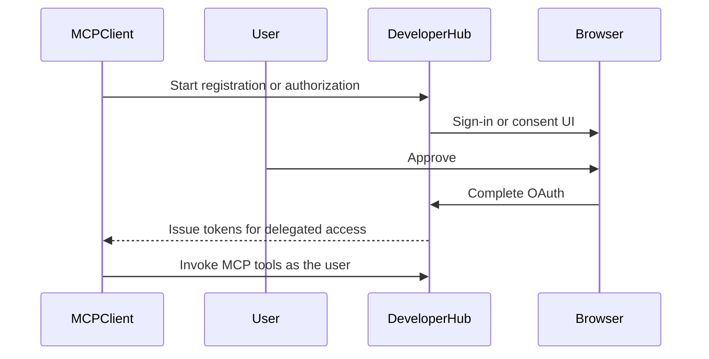

# MCP tools

Red Hat Developer Hub exposes a [Model Context Protocol](https://modelcontextprotocol.io/) (MCP) server.
With the default [`deploy/app.yaml`](#2-application-deployment), X2A registers MCP tools so assistants (for example Cursor, Continue, or other tool-aware clients) can work with migration projects through the same RHDH X2A instance you use in the browser.

Confirm your assistant supports **tool calling** before relying on MCP workflows.
For RHDH transport details and vendor-specific client snippets, see [Interacting with Model Context Protocol tools for Red Hat Developer Hub](https://docs.redhat.com/en/documentation/red_hat_developer_hub/1.9/html-single/interacting_with_model_context_protocol_tools_for_red_hat_developer_hub/index).

Get your RHDH base URL from the cluster after [Installation](#access-the-application).
That host must stay consistent with how users sign in and how MCP clients complete browser steps.

## Connect your MCP client

Use your RHDH host in place of `<my_developer_hub_domain>`.

| Transport | URL |
|-----------|-----|
| Streamable (recommended where supported) | `https://<my_developer_hub_domain>/api/mcp-actions/v1` |
| SSE (legacy, for clients without streamable support) | `https://<my_developer_hub_domain>/api/mcp-actions/v1/sse` |

Red Hat’s guide includes ready-made examples for Cursor, Continue, and other clients (headers, `Authorization: Bearer` where applicable).
See [Configuring MCP clients to access the RHDH server](https://docs.redhat.com/en/documentation/red_hat_developer_hub/1.9/html-single/interacting_with_model_context_protocol_tools_for_red_hat_developer_hub/index#proc-configuring-mcp-clients-to-access-the-rhdh-server).

## Test with the MCP Inspector

The [MCP Inspector](https://github.com/modelcontextprotocol/inspector) is useful to verify that your RHDH X2A endpoint responds and lists tools.

1. Install Node.js if needed, then run:

   ```bash
   npx @modelcontextprotocol/inspector
   ```

   Eventually for less strict dev flows:
   ```bash
   NODE_TLS_REJECT_UNAUTHORIZED=0 DANGEROUSLY_OMIT_AUTH=false npx @modelcontextprotocol/inspector
   ```

2. Open the URL the command prints (often `http://localhost:6274`).

3. Choose the transport your build supports (streamable HTTP or legacy SSE) and set the server URL to `https://<my_developer_hub_domain>/api/mcp-actions/v1` or the `/sse` variant.

4. On Connect, the inspector is navigated to the Consent page in the RHDH UI. Complete any browser sign-in or consent prompts you are prompted for.

The sample `app-config-rhdh` in this repository already allows `http://localhost:6274` under `backend.cors` for that workflow.
If you use another browser origin, add it there.
If a browser-based client fails with CORS errors against your public route, include your RHDH deployment’s `https://<my_developer_hub_domain>` origin in the same `backend.cors.origin` list (see [Advanced configuration](#advanced-configuration)).

## Authentication

### Delegated access (default)

The default manifest enables **OAuth2 Dynamic Client Registration (DCR)** under `auth.experimentalDynamicClientRegistration` and installs the X2A DCR frontend so consent can be served under `/oauth2/*`.
In typical use, the MCP client starts registration, the user signs in or approves access in the browser and subsequent tool calls run **on behalf of that user** with their RHDH identity and RBAC.

High-level sequence:



The bundled `backstage-plugin-mcp-actions-backend` image tag is chosen so this flow works on supported Red Hat Developer Hub versions.
If your platform team pins an older MCP actions image, delegated flows may be unreliable.
The minimal version (tag) is `pr_2236__0.1.11` or use `>=0.1.12`.

Upgrade that plugin per your release notes or use a [static token](#static-access-token-for-automation) instead.

### Static access token for automation
{: #static-access-token-for-automation}

Some deployments add **`backend.auth.externalAccess`** with a long-lived **Bearer** token mapped to a Backstage **`subject`** (for example `mcp-clients`).
That subject must be granted the same [Authorization]() roles as a human user for the actions you want.
If the subject has no `x2a` permissions, X2A tools will deny access.

Use static tokens when a non-interactive principal should call tools without a browser.
See [Advanced configuration](#advanced-configuration) for a minimal `externalAccess` fragment.

## X2A MCP tools

These tools mirror capabilities you already have in the Conversion Hub UI. Names and parameters are defined by the installed plugin version.

| Tool | Purpose | Typical inputs | What you get |
|------|---------|----------------|--------------|
| `x2a-list-projects` | List migration projects you are allowed to see | Pagination or filter fields as exposed by the tool | Projects with metadata and links into the RHDH UI where applicable |
| `x2a-create-project` | Start a new migration project | Project fields aligned with the create-project flow (source/target repos, owner, and so on) | Created project identifiers and next-step hints (for example running initialization) |
| `x2a-trigger-next-phase` | Start or advance a pipeline phase (for example init, analyze, migrate, publish) for a module or project | Identifiers for the project or module and the phase to run | Job or status information; errors if prerequisites are missing |
| `x2a-list-modules` | List modules belonging to a project | `projectId` | Module names, paths, status, and deep links to module detail in the RHDH UI |

**Repository access:** Creating projects or advancing phases often requires the same **Git provider access** as the web UI (OAuth tokens for source and target repositories). If the assistant runs as a static service principal, it may not be able to complete steps that need your personal SCM authorization. See [Authentication]() for how users sign in to GitHub, GitLab, or Bitbucket in RHDH.

**Tool descriptions:** The plugin can expose short descriptions and structured schemas so clients know how to call each tool. Your client’s tool list is the authoritative view for the exact parameter names on your deployment.

## Permissions

X2A MCP tools enforce the same RBAC rules as the REST API and UI.
Read-heavy tools (such as listing projects or modules) require permission to view those resources.
Write or job-starting tools require `update` or `use` access.
See [Authorization]() for `x2a.admin` and `x2a.user` and how to assign them to users, groups, or an MCP service subject.

## Advanced configuration
{: #advanced-configuration}

The following fragments belong in the **single** `app-config-rhdh.yaml` document carried by the `app-config-rhdh` ConfigMap (see [Installation]()). Keep **one** top-level `backend:` map and merge new keys into it instead of duplicating the key.

### CORS

The default file allows `http://localhost:6274` for the MCP Inspector. Add your public RHDH origin if a browser client needs it:

```yaml
backend:
  cors:
    origin:
      - http://localhost:6274
      - https://<my_developer_hub_domain>
    credentials: true
```

### Dynamic Client Registration

Tighten patterns for production.
Wildcards such as `https://*` are convenient in labs only, narrow the URL pattern to match requirements of your client as close as possible.

```yaml
auth:
  experimentalDynamicClientRegistration:
    enabled: true
    allowedRedirectUriPatterns:
      - "cursor://*"
      - "https://<trusted-client-callback-host>/*"
```

### Static token fragment

Generate a long random bearer token, inject it through your normal secret mechanism, and map it to a subject that has RBAC roles:

```yaml
backend:
  actions:
    pluginSources:
      - "x2a-mcp-extras"
  auth:
    externalAccess:
      - type: static
        options:
          token: ${MCP_TOKEN}
          subject: mcp-clients
```

The name after `${` must match the environment variable or substitution your operator resolves when loading config.

### MCP client compatibility

Some MCP clients mishandle namespaced tool names. The default manifest sets:

```yaml
mcpActions:
  namespacedToolNames: false
```

### Plugin image tags

If you change Red Hat Developer Hub or Backstage versions, update OCI references in the `dynamic-plugins` ConfigMap so every overlay tag matches your platform.
Published tags often look like `bs_<backstageVersion>__<pluginVersion>`.
Browse [rhdh-plugin-export-overlays packages](https://github.com/orgs/redhat-developer/packages?repo_name=rhdh-plugin-export-overlays) for current images.

## Further reading

- [Installation](): deploy manifests, secrets, and restarting the RHDH pod
- [Interacting with Model Context Protocol tools for Red Hat Developer Hub](https://docs.redhat.com/en/documentation/red_hat_developer_hub/1.9/html-single/interacting_with_model_context_protocol_tools_for_red_hat_developer_hub/index): RHDH MCP behavior and client examples
- Optional background on plugin sources: [rhdh-plugins workspaces/x2a](https://github.com/redhat-developer/rhdh-plugins/tree/main/workspaces/x2a)
